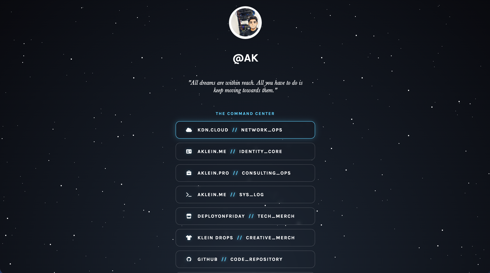
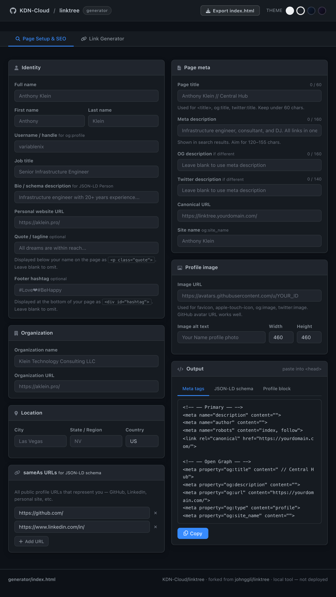
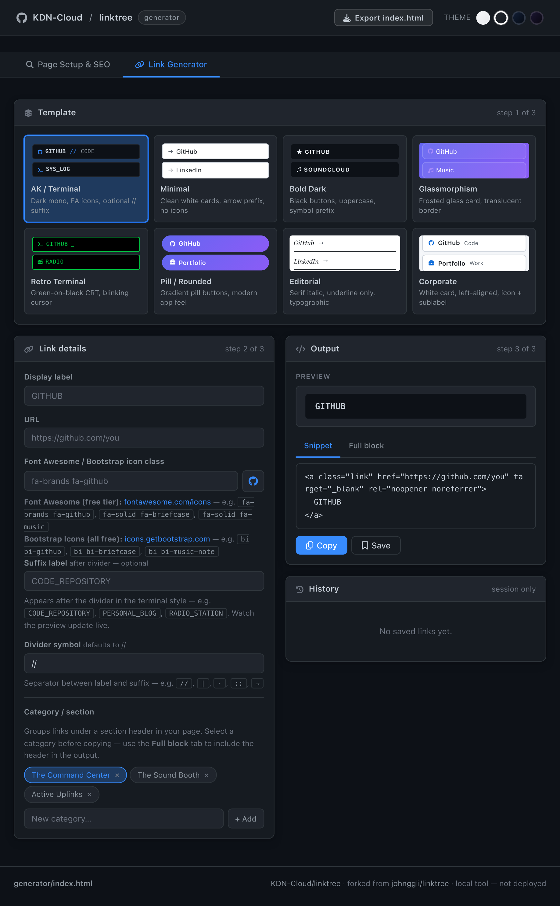

# KDN-Cloud / linktree

A self-hosted Linktree alternative built on plain HTML and CSS, deployed free via GitHub Pages with a custom domain through Cloudflare. No framework, no build step, no platform dependency.

**Live:** [links.aklein.pro](https://links.aklein.pro) · **Canonical:** [linktree.aklein.pro](https://linktree.aklein.pro)

Forked from [johnggli/linktree](https://github.com/johnggli/linktree).



---

## What's in this repo

| File | Purpose |
|---|---|
| `index.html` | The links page — profile, categories, and all link entries |
| `style.css` | All styling including the animated starfield background |
| `generator/index.html` | Local link generator tool — open in any browser, no server needed |
| `generator/assets/style.css` | Generator UI styles and themes |
| `generator/assets/templates.js` | Template build and preview logic |
| `generator/assets/app.js` | App state, UI, categories, history, copy |
| `generator/assets/screenshots/` | Generator UI screenshots |
| `CNAME` | Custom domain for GitHub Pages (`linktree.aklein.pro`) |

---

## Why meta tags and schema matter

When someone shares your links page in Slack, Discord, iMessage, or on social media, the platform fetches your page's meta tags to build a preview card — your name, description, and profile photo. Without them it shows the URL and nothing else. Open Graph tags control that preview on most platforms, Twitter Card tags handle X/Twitter specifically, and the JSON-LD schema block tells Google what your page actually is (a person's profile page) rather than making it guess. That structured data can improve how your page appears in search results and is the same technique used by major sites to get rich results. None of it is required for the page to work, but it's the difference between a link that looks professional when shared and one that looks like a dead URL.

---

## Using the generator

`generator/index.html` is a local tool for building link snippets without hand-editing HTML. Open it directly in your browser — no server required.

**Page Setup & SEO tab** — generates three ready-to-paste outputs:
- **Meta tags** — full `<head>` block covering primary SEO, Open Graph, and Twitter Card
- **JSON-LD schema** — structured data with `ProfilePage` and `Person` schema including `sameAs`, location, and `worksFor`
- **Profile block** — the `<header>` HTML for your page including profile image, username, optional quote/tagline, and optional footer hashtag

**Export index.html** — once you've filled in your details and saved your links to history, hit the **Export index.html** button in the topbar. It assembles a complete, ready-to-deploy `index.html` — head tags, JSON-LD schema, profile header, all your links grouped by category, and footer hashtag — and downloads it directly. No copy/paste required.

> **Note:** only links saved to the history panel are included in the export. Build each link, hit Save, then export when you're done.



**Link Generator tab** — pick a template, fill in your link details, copy the snippet.



**Eight template styles:**
- **AK / Terminal** — dark mono card, Font Awesome/Bootstrap icons, optional `//` suffix label
- **Minimal** — clean white card, arrow prefix, no icons
- **Bold Dark** — black button, uppercase, optional symbol prefix
- **Glassmorphism** — frosted glass card, translucent border, gradient backdrop
- **Retro Terminal** — green-on-black CRT style, blinking cursor
- **Pill / Rounded** — indigo-to-purple gradient pill, modern app feel
- **Editorial** — serif italic, underline-only border, typographic
- **Corporate** — white card, icon + label + optional sublabel, drop shadow

**Four UI themes:** Light, GitHub Dark, Navy, Dark Purple — switchable from the topbar.

Fill in your label, URL, icon class, and category, then copy the generated snippet and paste it into `index.html`. Use the history panel to save links mid-session (session only — clears on refresh).

**Icon sources (both free):**
- Font Awesome free tier: [fontawesome.com/search?m=free](https://fontawesome.com/search?m=free) — e.g. `fa-brands fa-github`, `fa-solid fa-music`
- Bootstrap Icons (all free): [icons.getbootstrap.com](https://icons.getbootstrap.com) — e.g. `bi bi-github`, `bi bi-music-note`

---

## Deploying your own

> **DNS provider note:** The steps below reference Cloudflare because that's what I use, but any DNS provider works. The only requirement is that you can create a `CNAME` record (or `A` records for an apex domain) pointing to GitHub Pages. The gray cloud / proxy warning is Cloudflare-specific — skip it if you're using a different provider.

1. **Fork this repo** to your GitHub account or organization
2. Edit `index.html` — swap in your name, photo URL, and links
3. Edit `CNAME` — replace `linktree.aklein.pro` with your domain
4. Enable **GitHub Pages** in repo Settings → Pages → set source branch to `master`, root directory
5. Add a DNS record pointing to GitHub Pages:
   ```
   Type:    CNAME
   Name:    linktree   (or whatever subdomain you want)
   Target:  <your-org-or-username>.github.io
   ```
6. Back in GitHub Pages settings, confirm your custom domain and enable **Enforce HTTPS**

DNS propagation typically takes 2–10 minutes. GitHub will show a warning until verification completes — that's normal.

> **Cloudflare users:** Set the record to **DNS only** (gray cloud, not orange). Cloudflare's proxy intercepts GitHub's domain verification check and breaks certificate provisioning. Gray cloud = DNS passthrough = works correctly.

---

## Customizing

**Profile image:** Use any publicly accessible URL. GitHub avatars work well:
```
https://avatars.githubusercontent.com/u/YOUR_NUMERIC_USER_ID
```

**Adding a link (AK Terminal style):**
```html
<a class="link" href="https://github.com/you" target="_blank" rel="noopener noreferrer">
  <i class="fa-brands fa-github"></i> GITHUB
  <span class="divider">//</span> CODE_REPOSITORY
</a>
```

The `//` is a hardcoded visual divider built into the template style. What comes after it — the suffix label — is entirely up to you: `CODE_REPOSITORY`, `PERSONAL_BLOG`, `RADIO_STATION`, anything. Leave out the `<span class="divider">` line entirely if you don't want a suffix on that link.

**Adding a category label:**

The generator handles this automatically. Select or create a category in the Link Generator tab, switch to the **Full block** output tab, and the `<div class="category-label">` header is included in the copied snippet. Examples from my setup: `The Command Center` for professional and infrastructure links, `The Sound Booth` for music and creative, `Active Uplinks` for communication channels.

To add one manually:
```html
<div class="category-label">The Command Center</div>
```

**Alias/redirect domain:** GitHub Pages serves one domain per repo. For a second URL pointing to the same page, set up a redirect at your DNS provider: `links.yourdomain.com/*` → `https://linktree.yourdomain.com/$1` (301). Cloudflare users can do this with a Redirect Rule in under a minute.

**Google Analytics:** The template includes Google Analytics via two script tags at the bottom of the `<head>`. If you don't want analytics, just delete both lines:

```html
<script async src="https://www.googletagmanager.com/gtag/js?id=G-XXXXXXXXXX"></script>
<script src="/gtag.js"></script>
```

You can also delete `gtag.js` from the repo root. The page works identically without them.

---

## Alias domains in use

| Domain | Type | Notes |
|---|---|---|
| `linktree.aklein.pro` | GitHub Pages (CNAME) | Canonical, served by Pages |
| `links.aklein.pro` | Cloudflare redirect (301) | Shorter URL, redirects to canonical |

---

## Full writeup

Step-by-step guide including the DNS setup, OG tags, category labels, and generator walkthrough:

[b.aklein.me — Ditching Linktree: Host Your Own Link Hub on GitHub Pages](https://b.aklein.me/2026/06/07/self-hosted-linktree-on-github-pages.html)

---

## License

MIT — see [LICENSE.md](LICENSE.md)

Copyright (c) 2021 John Emerson — original project at [johnggli/linktree](https://github.com/johnggli/linktree)  
Copyright (c) 2026 Anthony Klein / [KDN-Cloud](https://github.com/KDN-Cloud) — fork, generator, and extensions

---

Made with ❤️ by Anthony Klein 👋 [Get in touch](https://links.aklein.pro)
